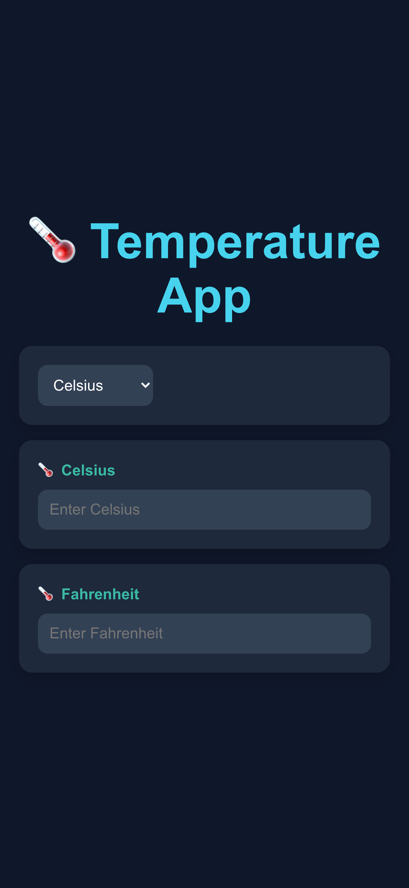
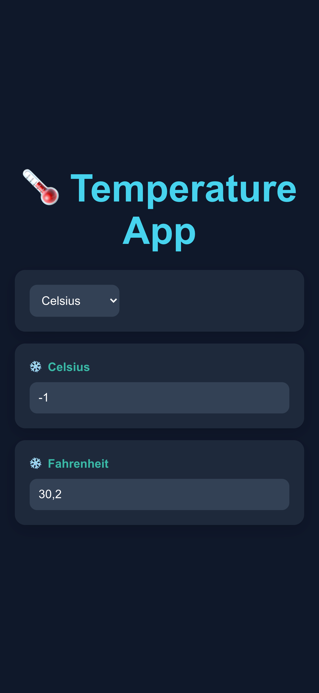
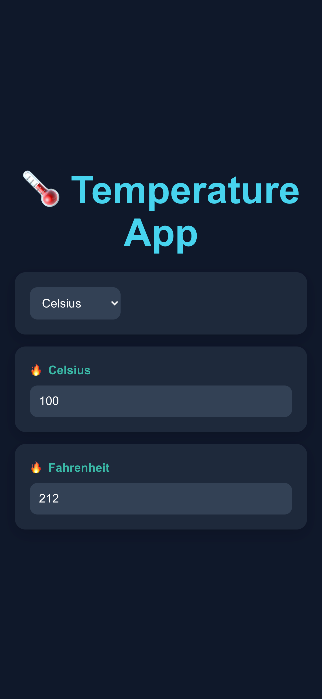
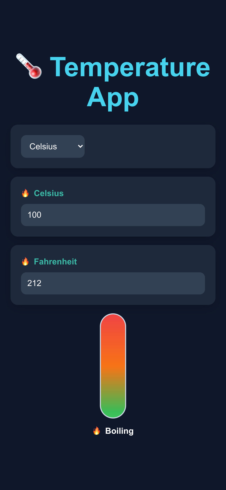
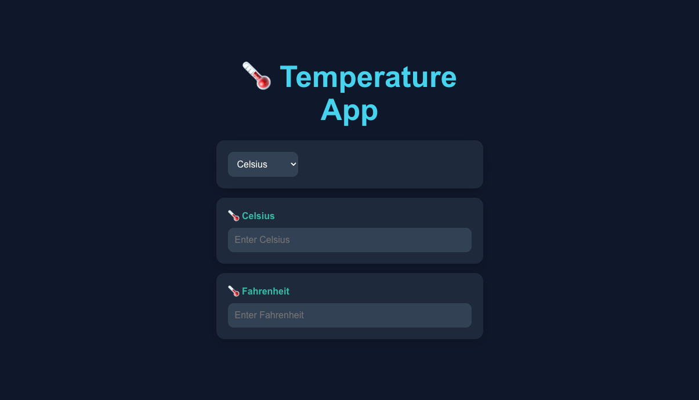
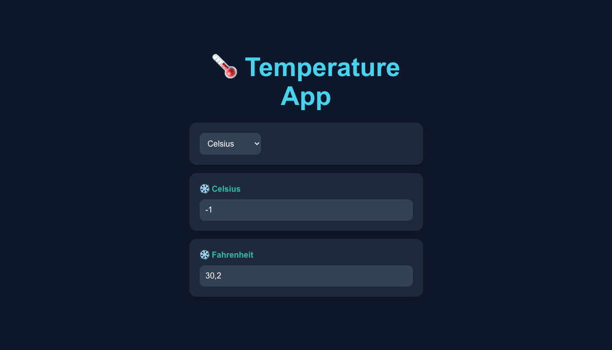
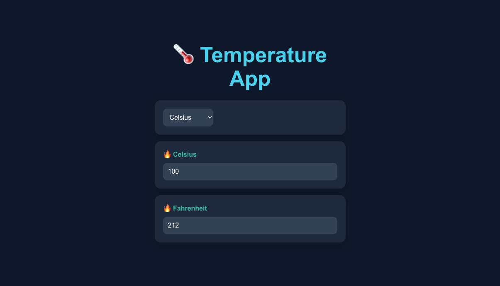
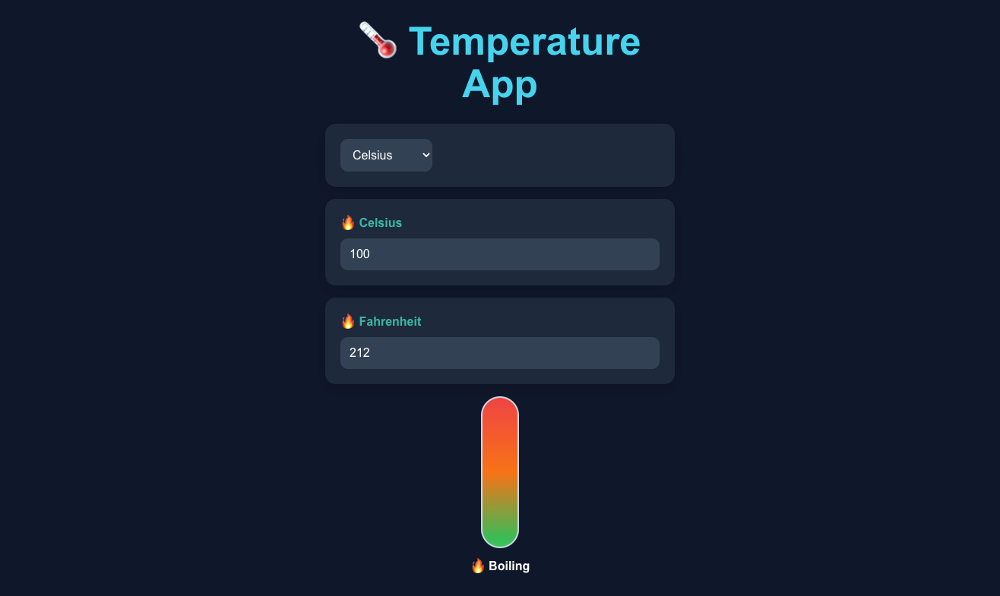

# 🌡️ Temperature Converter App

A simple React + TypeScript application that converts temperatures between Celsius and Fahrenheit.

---

## 📖 Description

This application allows users to type a temperature in either Celsius or Fahrenheit and instantly see the converted value in the other field both staying the same.

The goal of this project is to practice:
- Lifting state up to a common parent component
- Controlled components driven by React state
- TypeScript interfaces and union types
- Separating business logic from UI logic

---

## 🖥 Tech Stack

- React
- TypeScript
- Vite
- HTML5
- CSS3

---

## 📂 Project Structure

```
TEMPERATURE-APP/
│
├── public/
│   └── vite.svg
│
├── src/
│   ├── assets/
│   │   └── react.svg
│   │
│   ├── components/
│   │   ├── TemperatureConverter.tsx
│   │   ├── TemperatureInput.tsx
│   │   └── UnitSelector.tsx
│   │
│   ├── utils/
│   │   └── conversions.ts
│   │
│   ├── App.tsx
│   ├── App.css
│   ├── index.css
│   └── main.tsx
│
├── package.json
└── README.md
```

### Folder Responsibilities

- **components/** → UI components — converter, input field, unit dropdown
- **utils/** → Pure conversion logic — `toFahrenheit`, `toCelsius`, `convert`
- **assets/** → Images and screenshots

---

## 📸 Screenshots

### 📱 Mobile View


### 📱 Mobile View with Temperature Freezing


### 📱 Mobile View with Temperature Hot


### 📱 Mobile View with Themometer UI


### 💻 Desktop View


### 💻 Desktop View with Temperature Freezing


### 💻 Desktop View with Temperature Hot


### 💻 Desktop View with Thermometer UI


> Store screenshots in:
> `src/assets/screenshots/`

---

## ⚙️ Installation & Setup

1. Clone the repository:
   ```bash
   git clone https://github.com/SiegfriedV4/temperature-app.git
   ```

2. Navigate into the project:
   ```bash
   cd temperature-app
   ```

3. Install dependencies:
   ```bash
   npm install
   ```

4. Start the development server:
   ```bash
   npm run dev
   ```

---

## 🎯 What I Learned

- How to lift state up to a common parent component
- The difference between state and derived values
- How controlled components work in React
- TypeScript union types (`'c' | 'f'`) for precise type safety
- Separating pure utility functions from UI components
- Git branch workflow — feature branches, PRs, merging into dev

---

## 🚀 Future Improvements

- Add Kelvin as a third conversion unit
- Add location-based temperature lookup via a weather API
- Style the UI with a dedicated styles folder architecture